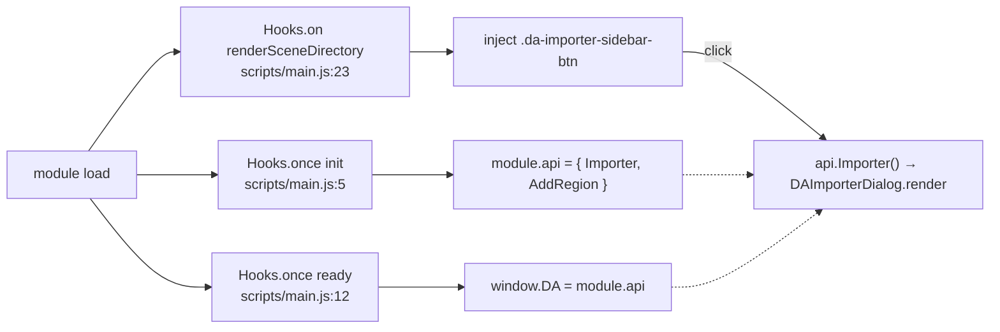
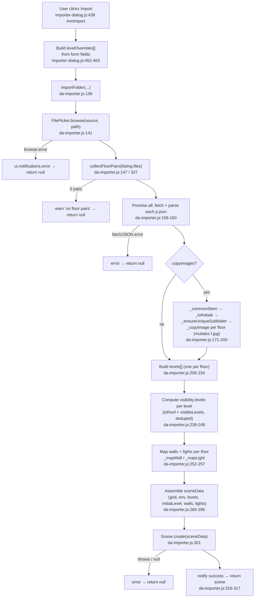
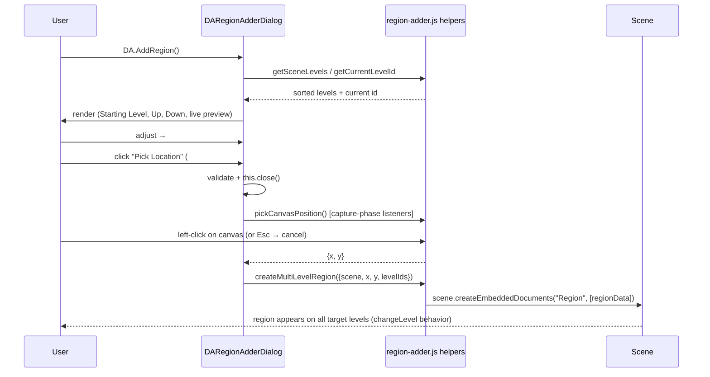

# DA Level Importer — Architecture

Developer documentation for the **Dungeon Alchemist Level Importer** Foundry VTT module
(`module.json:2` → id `da-level-importer`, version `0.0.4`, compatibility minimum/verified `14`,
authored by *Mestre Digital*; `module.json:6-9`, `module.json:11-17`).

The module imports a multi-floor Dungeon Alchemist export — one background media file
(image **or** video) plus one `.json` per floor — into a **single Foundry v14 Scene** that uses
**native v14 Scene Levels**, with walls/doors/lights bound to each level. It also ships a region
tool that creates multi-level staircase/elevator transit regions.

> All references below are `file:line` into the real source as of v0.0.4. Where behavior is
> inferred or relies on undocumented Foundry internals, this is called out explicitly.

---

## Table of Contents

1. [Overview & Entry Points](#1-overview--entry-points)
2. [Import Data Flow (End-to-End)](#2-import-data-flow-end-to-end)
3. [Key Data Shapes](#3-key-data-shapes)
4. [The Importer Dialog](#4-the-importer-dialog)
5. [The Region Adder](#5-the-region-adder)
6. [v14-Specific APIs Relied Upon](#6-v14-specific-apis-relied-upon)
7. [Extension Points — Where to Change Things](#7-extension-points--where-to-change-things)

---

## File Map

| File | Role |
| --- | --- |
| `scripts/main.js` | Entry hooks (`init`/`ready`), the `DA` global API, Scenes-sidebar button injection |
| `scripts/da-importer.js` | Core import logic: pairing, fetch/parse, copy-to-world, Scene payload, wall/light mapping |
| `scripts/importer-dialog.js` | `DAImporterDialog` — the tabbed ApplicationV2 UI |
| `scripts/region-adder.js` | Region helpers: level introspection, canvas click capture, region creation |
| `scripts/region-adder-dialog.js` | `DARegionAdderDialog` — the region configuration ApplicationV2 UI |
| `scripts/constants.js` | `MODULE_ID`, `FLOOR_HEIGHT` shared constants |
| `templates/importer.hbs` | Handlebars template for the importer dialog |
| `templates/region-adder.hbs` | Handlebars template for the region dialog |
| `styles/module.css` | All module styling (dialogs, tabs, toggles, dropdowns, sidebar button) |
| `module.json` | Manifest (esmodule entry = `scripts/main.js`; `module.json:19-22`) |

---

## 1. Overview & Entry Points

The module is loaded as a single ES module via `module.json:19-21` (`esmodules: ["scripts/main.js"]`),
with `styles/module.css` registered as the only stylesheet (`module.json:22`).

### `init` hook — register the API (`scripts/main.js:5-10`)

```js
Hooks.once("init", () => {
  game.modules.get(MODULE_ID).api = {
    Importer: () => new DAImporterDialog().render(true),
    AddRegion: () => new DARegionAdderDialog().render(true)
  };
});
```

On `init`, the module attaches an `api` object onto its own module entry. The API has two members:

- `Importer()` — constructs and renders a `DAImporterDialog` (`scripts/importer-dialog.js:33`).
- `AddRegion()` — constructs and renders a `DARegionAdderDialog` (`scripts/region-adder-dialog.js:19`).

`MODULE_ID` is the shared constant `"da-level-importer"` (`scripts/constants.js:2`), kept in sync
with `module.json:2`.

### `ready` hook — expose the `DA` global (`scripts/main.js:12-14`)

```js
Hooks.once("ready", () => {
  window.DA = game.modules.get(MODULE_ID).api;
});
```

This makes the same API reachable from the browser console or any macro as `DA.Importer()` /
`DA.AddRegion()`. The canonical, namespaced access path remains
`game.modules.get("da-level-importer").api.{Importer,AddRegion}()`; `DA` is a convenience alias bound
to the identical object.

### Scenes-directory sidebar button injection (`scripts/main.js:23-40`)

```js
Hooks.on("renderSceneDirectory", (_app, html) => {
  if (html.querySelector(".da-importer-sidebar-btn")) return;          // idempotency guard
  const header = html.querySelector(".directory-header");
  if (!header) return;
  const btn = document.createElement("button");
  btn.type = "button";
  btn.className = "da-importer-sidebar-btn";
  btn.innerHTML = '<i class="fas fa-file-import"></i> DA Level Importer';
  btn.addEventListener("click", () => game.modules.get(MODULE_ID).api.Importer());
  const actionButtons = header.querySelector(".action-buttons") ?? header.querySelector(".header-actions");
  const anchor = actionButtons ? actionButtons.nextSibling : null;
  header.insertBefore(btn, anchor);
});
```

Notable details:

- The hook fires on **every** `SceneDirectory` render; the early-return guard at `scripts/main.js:24`
  prevents duplicate buttons.
- The handler receives the **DOM element** (`html`) directly and calls `querySelector` on it —
  this is the ApplicationV2 hook signature, not the jQuery object older Foundry passed.
- Placement is defensive: it looks for `.action-buttons` and falls back to `.header-actions`
  (`scripts/main.js:37`), inserting the button **after** the native Create-Scene/Create-Folder
  buttons so it lands between them and the search bar regardless of the search element's
  tag/class in v14 (`scripts/main.js:35-39`).
- The button click goes through the namespaced API (`game.modules.get(MODULE_ID).api.Importer()`),
  not the `DA` global — so it works even if something has clobbered `window.DA`.
- Styling: `.da-importer-sidebar-btn` is full-width minus padding (`styles/module.css:2-5`).



---

## 2. Import Data Flow (End-to-End)

The whole pipeline lives in `importFolder(...)` (`scripts/da-importer.js:136-318`), driven by the
dialog's `#onImport` handler (`scripts/importer-dialog.js:438-467`). The stages below trace one
import from the user's click to `Scene.create`.



### Stage 1 — Folder browse (dialog side)

`#onBrowse` (`scripts/importer-dialog.js:69-92`) opens a `FilePicker` in `folder` mode
(`scripts/importer-dialog.js:71-72`). On selection, the callback:

1. Writes the chosen path into the hidden/readonly inputs `folder` and `source`
   (`scripts/importer-dialog.js:75-79`); `source` defaults to the picker's `activeSource`
   or `"data"`.
2. Immediately calls `FilePicker.browse(source, path)` and feeds the file list into
   `collectFloorPairs` to populate `this._floorPairs` (`scripts/importer-dialog.js:83-84`).
3. Calls `_populateLevelsTab()` to rebuild the Levels-tab rows (`scripts/importer-dialog.js:88`).

So the **dialog browses the folder twice** in effect: once eagerly (to render per-level rows),
and again inside `importFolder` at import time (`scripts/da-importer.js:141`) as the source of truth.

### Stage 2 — `collectFloorPairs` (pairing rules, sorting, image-vs-video precedence)

`collectFloorPairs(files)` (`scripts/da-importer.js:327-361`) is the heart of pairing. It is
**exported** so the dialog can inspect pairs before a full import.

Inputs are full URLs from `FilePicker.browse()`. The algorithm:

1. **Group by filename stem** (`scripts/da-importer.js:328-346`). For each file it
   `decodeURIComponent`s the basename, splits off the extension, and keys a `Map` by the stem
   (everything before the final dot).
2. **Filter to relevant extensions** (`scripts/da-importer.js:335`): only `json` or a member of
   `MEDIA_EXTS` is considered; anything else is skipped.
   - `IMAGE_EXTS = ["jpg", "jpeg", "png", "webp"]` (`scripts/da-importer.js:26`)
   - `VIDEO_EXTS = ["webm", "mp4", "m4v"]` (`scripts/da-importer.js:27`)
   - `MEDIA_EXTS = [...IMAGE_EXTS, ...VIDEO_EXTS]` (`scripts/da-importer.js:28`)
3. **Slot assignment per stem** (`scripts/da-importer.js:338-345`):
   - `json` files fill `entry.json`.
   - Media files fill `entry.img` / `entry.imgExt`, but only if the slot is empty **or** the new
     file is a video while the existing one is not. This is the **image-vs-video precedence**
     introduced for webm support: *one media file per floor, and a video always wins over a static
     image of the same stem* (comment at `scripts/da-importer.js:341-342`). Note that the slot is
     **not** keyed by arrival order — a later static image will not displace an already-chosen one,
     and a video will displace a static image regardless of order.
4. **Build pair objects** (`scripts/da-importer.js:348-358`): only stems that have **both** a
   `json` and an `img` become a pair (`scripts/da-importer.js:350`). The floor index is parsed from
   the `-_NN` suffix via `FLOOR_RE = /-_(\d+)$/` (`scripts/da-importer.js:19`, applied at
   `:351`); stems without the suffix get `index: 0`.
5. **Sort** (`scripts/da-importer.js:359`): ascending by parsed `index`, then `localeCompare` on
   the stem as a tiebreaker.

The resulting pair object is `{ stem, index, json, jpg }` — note the field is named `jpg`
(`scripts/da-importer.js:352-357`) even though it may hold a `.webm`/`.png`/etc. URL. That naming
is historical; treat `jpg` as "the background media URL for this floor".

> Pairing is purely filename-stem based, which is why the README requires one map per folder
> (`README.md:19`).

### Stage 3 — JSON fetch & parse (`scripts/da-importer.js:154-164`)

All pairs are fetched in parallel with `Promise.all`. Each floor object is a **shallow copy** of its
pair plus a `data` field holding the parsed JSON (`{ ...p, data: await res.json() }`,
`scripts/da-importer.js:159`). A non-OK HTTP response throws and aborts the whole import with an
error notification (`scripts/da-importer.js:158`, `:161-164`).

The shallow-copy detail matters later: because `floors[i]` is its own object, the copy-to-world
stage can mutate `floors[i].jpg` without touching the original `pairs[i]`
(comment at `scripts/da-importer.js:190-192`).

### Stage 4 — Optional copy-to-world (`scripts/da-importer.js:171-200`)

Gated on the `copyImages` flag. When enabled, the world becomes self-contained: images are copied
into `worlds/<id>/da-imported/<map>/` and renamed to kebab-case.

- **Destination folder name** comes from `_commonStem(pairs)` (`scripts/da-importer.js:172` →
  `:369-372`), which strips the `-_NN` suffix from the first stem; it is then kebab-cased via
  `_toKebab` (`scripts/da-importer.js:173`), falling back to `"da-map"`.
- **`_ensureUniqueSubfolder(baseName)`** (`scripts/da-importer.js:72-98`):
  - `root = worlds/<game.world.id>/da-imported` (`scripts/da-importer.js:74`).
  - Best-effort `FP.createDirectory("data", root, {})`, ignoring errors if it already exists
    (`scripts/da-importer.js:76-78`).
  - Then probes `root/<candidate>` by calling `FP.browse(...)`: **success means the directory
    already exists** (so try the next name); a thrown error means it's free
    (`scripts/da-importer.js:84-90`). The first free slot is created and returned.
  - Collision handling appends an incrementing integer: `tavern → tavern1 → tavern2 …`
    (`scripts/da-importer.js:95-96`).
- **Per-floor copy** (`scripts/da-importer.js:182-198`):
  - Derives the original filename and extension from `f.jpg` (decoding the URL;
    `scripts/da-importer.js:184-187`), defaulting the extension to `"jpg"` if there's no dot.
  - Computes the kebab filename from `f.stem` via `_toKebab` (`scripts/da-importer.js:188`).
  - Calls `_copyImage(...)` and **reassigns `f.jpg`** to the uploaded path
    (`scripts/da-importer.js:193`). Because the `levels[]` build below reads `f.jpg`, this is what
    redirects the Scene to the copies.
  - Any failure aborts with an error notification and `return null`
    (`scripts/da-importer.js:194-197`).
- **`_copyImage(srcUrl, destFolder, kebabStem, ext)`** (`scripts/da-importer.js:110-122`):
  `fetch`es the source URL, wraps the blob in a `File` named `<kebabStem>.<ext>`, and
  `FP.upload("data", destFolder, file, {})`, returning `result.path`. A non-OK fetch throws
  (`scripts/da-importer.js:114`).
- **`_toKebab(name)`** (`scripts/da-importer.js:53-60`): NFD-normalizes, strips combining
  diacritics (`[̀-ͯ]`), collapses any non-alphanumeric run to a single `-`, trims leading/
  trailing hyphens, and lowercases.

> The `_copyImage` extension is computed from `f.jpg` (the chosen media URL), so video floors are
> copied with their real extension (`.webm` etc.), preserving the animated background.

### Stage 5 — Build `levels[]` (`scripts/da-importer.js:206-234`)

One Scene Level per floor. For floor `i`:

- `name` = override's trimmed name, else `` `Floor ${i}` `` (`scripts/da-importer.js:208`).
- **Default elevation** uses `FLOOR_HEIGHT` (= 10; `scripts/constants.js:8`):
  - `defaultBottom = i === 0 ? 0 : i * FLOOR_HEIGHT + 1` (`scripts/da-importer.js:209`).
  - `defaultTop = (i + 1) * FLOOR_HEIGHT` (`scripts/da-importer.js:210`).
  - i.e. `0–10`, `11–20`, `21–30`, … — the `+1` (added in v0.0.2) prevents adjacent floors from
    sharing a boundary elevation (`CHANGELOG.md:30-31`).
  - Overrides win only when finite: `Number.isFinite(ov?.bottom) ? ov.bottom : defaultBottom`
    (`scripts/da-importer.js:211-212`).
- `_id` is a fresh `foundry.utils.randomID()` (`scripts/da-importer.js:214`); this id is the
  binding key reused by walls, lights, `initialLevel`, and `visibility.levels`.
- `background.src` = `f.jpg` (the possibly-copied media URL; `scripts/da-importer.js:218`).
- `sort = i` (`scripts/da-importer.js:231`).

The complete emitted Level shape is documented in [§3](#scene-level-object).

#### `visibility.levels` second pass (`scripts/da-importer.js:239-248`)

After all levels exist (so their `_id`s are known), `visibility.levels` is computed per level by
**merging two sources, deduplicated**:

- **`isRoof` shortcut**: if `i > 0` and the override marks this level a roof, push the
  *immediately-lower* level's id (`scripts/da-importer.js:242`). Per the toggle's tooltip, a roof
  renders only when the floor directly below it is active (`scripts/importer-dialog.js:301`).
- **Explicit `visibleLevels`**: for each selected index `j`, push `levels[j]._id` if present and
  not already included (`scripts/da-importer.js:243-246`).

### Stage 6 — Map walls & lights (`scripts/da-importer.js:250-257`)

For each floor, with `levelId = levels[i]._id` and `bottom = i * FLOOR_HEIGHT` (note: this light
elevation base is **not** the `+1`-offset `defaultBottom`; it's the raw `i * FLOOR_HEIGHT`,
`scripts/da-importer.js:254`):

- `f.data.walls ?? []` → `_mapWall(w, levelId, doorTexture, doorSound)`
  (`scripts/da-importer.js:255`).
- `f.data.lights ?? []` → `_mapLight(l, levelId, bottom)` (`scripts/da-importer.js:256`).

Mapping details are in [§3](#wall-document-mapping). Counts are logged at
`scripts/da-importer.js:258`.

### Stage 7 — Assemble `sceneData` & create (`scripts/da-importer.js:260-318`)

The Scene payload (`scripts/da-importer.js:260-295`) pulls map-wide properties from the **first
floor's JSON** (`first = floors[0].data`, `scripts/da-importer.js:203`):

- `name` = `_commonStem` result, else `"Dungeon Alchemist Map"` (`scripts/da-importer.js:261`).
- `width` / `height` / `padding` from `first` (padding defaults `0.25`;
  `scripts/da-importer.js:262-264`).
- `grid`: `type: 1` (square), `size: first.grid`, plus color/alpha/distance/units pulled from
  `first` with fallbacks (`scripts/da-importer.js:266-275`); `alpha` is the dialog's `gridAlpha`.
- `tokenVision: true`, `fog.mode: 1` (`scripts/da-importer.js:276-277`).
- `environment` block (`scripts/da-importer.js:278-290`): `darknessLevel`, a `globalLight` whose
  `enabled` mirrors `!!first.globalLight`, plus static `base`/`dark` color grading.
- `levels` (from Stage 5), `initialLevel`, `walls`, `lights` (`scripts/da-importer.js:291-294`).
- **`initialLevel`** = `(levels[initialLevelIndex] ?? levels[0])._id`
  (`scripts/da-importer.js:292`) — the selected floor's id, falling back to the first level.

`Scene.create(sceneData)` is wrapped in try/catch (`scripts/da-importer.js:299-306`); a thrown
error or a falsy return both abort with notifications (`scripts/da-importer.js:307-310`). On
success it reads back `scene.levels` / `scene.walls` / `scene.lights` sizes for a confirmation
notification (`scripts/da-importer.js:312-317`). The function returns the created `Scene` (or
`null`). Back in the dialog, a truthy result closes the dialog (`scripts/importer-dialog.js:466`).

---

## 3. Key Data Shapes

### The floor-pair object (`collectFloorPairs`)

Produced at `scripts/da-importer.js:352-357`:

```js
{
  stem:  "TavernMap-_1",   // filename stem (no extension)
  index: 1,                // parsed from the -_NN suffix (FLOOR_RE), else 0
  json:  "<url>.json",     // the .json sibling URL
  jpg:   "<url>.webm"      // the chosen background MEDIA url (image OR video)
}
```

After `Promise.all` (`scripts/da-importer.js:159`) each **floor object** is `{ ...pair, data }`,
where `data` is the parsed DA JSON. If `copyImages` is on, `floor.jpg` is later overwritten with the
copied path (`scripts/da-importer.js:193`).

<a name="scene-level-object"></a>
### The Scene Level object (every field)

Emitted at `scripts/da-importer.js:213-233`, with `visibility.levels` filled by the second pass
(`scripts/da-importer.js:247`):

```js
{
  _id: "<randomID>",                       // da-importer.js:214 — binding key
  name: "Floor 0",                         // override or `Floor ${i}`        :208
  elevation: { bottom, top },              // override or FLOOR_HEIGHT default :211-212, :217
  background: {
    src: f.jpg,                            // floor media (possibly copied)   :218
    color: backgroundColor,                // dialog background color         :219
    tint: "#ffffff",
    alphaThreshold: 0.75
  },
  foreground: { src: null, tint: "#ffffff", alphaThreshold: 0.75 },  // :223
  fog: { src: null, tint: "#ffffff" },                                // :224
  textures: {                                                         // :225-229
    anchorX: 0.5, anchorY: 0.5,
    offsetX: 0, offsetY: 0,
    fit: "fill", scaleX: 1, scaleY: 1, rotation: 0
  },
  visibility: { levels: [/* ids */] },     // filled by 2nd pass             :230, :247
  sort: i,                                 // floor index                    :231
  flags: {}                                // :232
}
```

### DA → Foundry wall enum (`_wallEnum`)

`_wallEnum(v)` (`scripts/da-importer.js:383-387`) maps DA's compact `{0: none, 1: normal,
2: limited}` scheme to v14 `WALL_*` enum values `{NONE: 0, LIMITED: 10, NORMAL: 20}`:

| DA value | meaning | Foundry value |
| --- | --- | --- |
| `2` | limited | `10` (`WALL_SENSE_TYPES.LIMITED`) |
| `1` | normal | `20` (`WALL_SENSE_TYPES.NORMAL`) |
| anything else (incl. `0`) | none | `0` (`WALL_SENSE_TYPES.NONE`) |

It clamps to exactly the three values DA emits (comment at `scripts/da-importer.js:377-381`).

<a name="wall-document-mapping"></a>
### Wall document mapping (`_mapWall`)

`_mapWall(daWall, levelId, doorTexture, doorSound)` (`scripts/da-importer.js:401-416`):

```js
{
  c: daWall.c,                       // [x1,y1,x2,y2] segment endpoints, passed through
  move:  _wallEnum(daWall.move  ?? 1),
  sight: _wallEnum(daWall.sense ?? 1),   // NB: DA field is `sense`, Foundry field is `sight`
  sound: _wallEnum(daWall.sound ?? 1),
  door:  daWall.door ?? 0,           // 0 none, 1 door (DA passthrough)
  ds: 0,                             // door state: closed
  levels: [levelId]                  // SceneLevelsSetField binding
}
```

If `daWall.door === 1` **and** the dialog supplied options
(`scripts/da-importer.js:411-414`):

- `doorTexture` (non-empty) → `wallDoc.animation = { texture: doorTexture, type: "swing" }`.
- `doorSound` (non-empty) → `wallDoc.doorSound = doorSound` (a `CONFIG.Wall.doorSounds` key).

Defaults of `?? 1` on `move`/`sense`/`sound` mean an absent DA flag is treated as *normal*
(→ `20`).

<a name="light-document-mapping"></a>
### Light document mapping (`_mapLight`)

`_mapLight(daLight, levelId, elevation)` (`scripts/da-importer.js:428-448`):

```js
{
  x: daLight.x, y: daLight.y,
  rotation: 0,
  walls: true,                       // light occluded by walls
  vision: false,
  elevation,                         // = i * FLOOR_HEIGHT (floor bottom)    da-importer.js:254
  config: {
    dim:   daLight.dim,
    bright: daLight.bright,
    color: daLight.tintColor ?? null,
    alpha: daLight.tintAlpha ?? 0.5,
    angle: 360,
    coloration: 1,
    luminosity: 0.5,
    animation: { type: null, speed: 5, intensity: 5, reverse: false }
  },
  levels: [levelId]                  // SceneLevelsSetField binding
}
```

`elevation` is stamped to the floor bottom as a sensible default so the light sorts correctly in
3D-aware tooling (comment at `scripts/da-importer.js:418-427`).

### Region document (see also §5)

Built in `createMultiLevelRegion` (`scripts/region-adder.js:141-173`). Summary:

```js
{
  name, color: "#b0cc28",
  elevation: { bottom: minBottom, top: maxTop },  // spans the bound levels  region-adder.js:138-139,:144
  levels: levelIds,                               // Set of bound level ids  :145
  visibility: 2, highlightMode: "shapes",
  displayMeasurements: false, hidden: false,
  shapes: [ { type: "rectangle", x, y, width: gridSize, height: gridSize, ... } ],  // :150-163
  behaviors: [ { name: "Change Level", type: "changeLevel", system: {}, disabled: false, flags: {} } ]  // :164-172
}
```

---

## 4. The Importer Dialog

`DAImporterDialog` (`scripts/importer-dialog.js:33-468`).

### Class structure (ApplicationV2 + HandlebarsApplicationMixin)

```js
const { ApplicationV2, HandlebarsApplicationMixin } = foundry.applications.api;   // :4
export class DAImporterDialog extends HandlebarsApplicationMixin(ApplicationV2) { ... }
```

**Instance state** (`scripts/importer-dialog.js:34-41`):

- `_floorPairs` — the pairs from the last folder browse (`:35`).
- `_visDropdowns` — body-attached dropdown elements to clean up on rebuild/close (`:36`).
- `_visCheckboxes` — `Map` keyed `"levelIndex,otherIndex"` for O(1) lookup at import time (`:38-39`).
- `_initialLevelIndex` — zero-based initial level, default `0` (`:40-41`).

**`DEFAULT_OPTIONS`** (`scripts/importer-dialog.js:42-61`):

- `id: "da-importer"`, `tag: "form"`, `form.closeOnSubmit: false`.
- `window.title`, `window.resizable: false`; `position.width: 620` (widened in v0.0.3 to fit the
  Visible column — `CHANGELOG.md:20-21`), `height: "auto"`.
- **`actions`** map (the ApplicationV2 click-delegation system; keyed by `data-action` in the
  template): `browse → #onBrowse`, `import → #onImport`, `previewSound → #onPreviewSound`
  (`:56-60`).

**`PARTS`** (`scripts/importer-dialog.js:63-67`): a single `form` part →
`modules/da-level-importer/templates/importer.hbs`.

### Tabbed UI (`templates/importer.hbs` + `_onRender`)

The template declares three tab buttons and three panels keyed by `data-tab`: **Scene Defaults**,
**Doors**, **Levels** (`templates/importer.hbs:14-18`, panels at `:20`, `:67`, `:145`). The Scene
Defaults tab is active by default (`da-tab-btn--active`, `templates/importer.hbs:15`).

Tab switching is wired in `_onRender` (`scripts/importer-dialog.js:134-147`): clicking a
`.da-tab-btn` toggles `da-tab-btn--active` + `aria-selected` on the buttons and
`da-tab-panel--hidden` on the panels. (`.da-tab-panel--hidden { display: none }`,
`styles/module.css:59-61`.)

`_onRender` also handles (`scripts/importer-dialog.js:122-197`):

- **Grid-alpha range sync** (`:124-131`) — mirrors the slider value into `.range-value`, formatted
  to 2 decimals.
- **Door texture preview + tooltip** (`:150-178`) — sets `.da-door-preview` `src` from the
  `doorTexture` select and shows an enlarged hover tooltip appended to `document.body`
  (`:162-177`).
- **Uniform floor-height recompute** (`:181-193`) — on change, recalculates every
  `levelBottom[i]`/`levelTop[i]` input using `i === 0 ? 0 : i*h+1` and `(i+1)*h`, mirroring the
  importer's defaults.
- Finally re-runs `_populateLevelsTab()` so rows survive any re-render (`:196`).

### Doors tab

Pure template (`templates/importer.hbs:67-143`): a 25-option **door texture** `<select>` (each value
a `canvas/doors/...webp` path; `:73-100`) with the preview ``
(`:101`), and a 21-option **door sound** `<select>` (`:111-134`) with a `previewSound` button
(`:135-137`). `#onPreviewSound` (`scripts/importer-dialog.js:104-111`) resolves the selected key
through `CONFIG.Wall.doorSounds`, picks `open` (falling back to `close`), and plays it via
`foundry.audio.AudioHelper.play(...)`.

### Levels-tab construction (`_populateLevelsTab`, `scripts/importer-dialog.js:219-422`)

This method **fully rebuilds** the Levels list from `this._floorPairs`. It is called after a folder
browse (`:88`) and after every render (`:196`).

1. **Teardown** prior body dropdowns via `_teardownVisDropdowns()` (`:220` → `:203-207`).
2. **Placeholder vs list** (`:222-233`): with no pairs, the
   `.da-levels-placeholder` ("Select a folder above…", `templates/importer.hbs:157`) is shown and
   the list cleared; otherwise the placeholder is hidden and the list rebuilt.
3. **Header row** (`:236-243`): columns `# · "" · Name · Bottom · Top · Roof · Start · Visible`.
4. **First pass — one `.da-level-row` per floor** (`:246-327`):
   - Index badge (`:255-257`).
   - **Thumbnail** via `_buildThumbEl(pair.jpg, "da-level-thumb")` (`:259`) plus a hover tooltip
     (also built with `_buildThumbEl`) appended to `document.body` (`:262-276`).
   - `levelName[i]` text input defaulting to `` `Floor ${i}` `` (`:278-282`).
   - `levelBottom[i]` / `levelTop[i]` number inputs seeded with the `FLOOR_HEIGHT` defaults
     (`:249-250`, `:284-296`).
   - **Roof toggle** `levelIsRoof[i]` — a styled checkbox with the roof-behavior tooltip
     (`:299-312`).
   - **Initial-level star button** (`:314-323`) — `★`/`☆`, `da-initial-btn--active` when
     `i === this._initialLevelIndex`.
5. **Initial-level wiring** (`:329-341`): clicking any star sets `_initialLevelIndex` and resets all
   other stars — a radio-style, single-select toggle.
6. **Second pass — Visible Levels dropdown per row** (`:343-421`): see below.

#### The Visible Levels dropdowns (and why they're appended to `document.body`)

Built in the second pass so that, by the time a dropdown is created, **all** rows (and their
name inputs) exist and each dropdown can list *every other* level by name
(`scripts/importer-dialog.js:343-373`):

- Each row gets a `.da-vis-wrap` containing a `.da-vis-btn` and a `.da-vis-dropdown`.
- The dropdown is `document.body.appendChild`'d and tracked in `_visDropdowns`
  (`:359-360`).
- For every other level `j`, a checkbox `levelVisibility[i][j]` is created, registered in
  `_visCheckboxes` under key `` `${i},${j}` `` (`:362-373`), labeled with that level's name.
- The button label (`updateBtn`, `:379-393`) shows `— ▾` for none, `N ▾` for a single selection,
  and `Many ▾` (with a `title` listing all indices) for multiple.
- Clicking the button (`:396-417`) closes all other dropdowns, positions this one using
  `getBoundingClientRect()` + `position: fixed`, and installs a deferred outside-click handler
  (via `setTimeout(..., 0)` so the opening click doesn't immediately close it).

**Why `document.body`:** the dropdown is `position: fixed` (`styles/module.css:308-319`).
Foundry's ApplicationV2 window uses a CSS `transform` for positioning, and a `position: fixed`
descendant of a transformed ancestor is positioned **relative to that transformed ancestor**, not
the viewport — so the dropdown would land at the wrong screen coordinates. Re-parenting it to
`document.body` (outside the window's transform) makes its fixed coordinates viewport-relative again
(comments at `scripts/importer-dialog.js:216-218`, `:344-345`, and `styles/module.css:306-307`).
The trade-off is manual lifecycle management: dropdowns are explicitly removed in
`_teardownVisDropdowns()` and on `_onClose` (`:431-436`).

#### Thumbnails: image-vs-video (`_buildThumbEl`, `isVideoPath`)

`_buildThumbEl(src, className)` (`scripts/importer-dialog.js:15-31`): if `isVideoPath(src)` it builds
a `<video>` that is `muted`, `loop`, `autoplay`, `playsInline` (so it animates silently in place;
`:16-25`); otherwise a plain `` (`:26-30`).

`isVideoPath(path)` (`scripts/da-importer.js:38-43`, exported): strips any `?`/`#` query/hash, takes
the lowercased extension, and returns whether it's in `VIDEO_EXTS`. It's used for both the row
thumbnail and the hover tooltip (`scripts/importer-dialog.js:259`, `:266`), and the tooltip CSS sizes
`img` and `video` identically (`styles/module.css:386-392`).

### Import handler & teardown

- **`#onImport`** (`scripts/importer-dialog.js:438-467`): reads `folder`/`source` (warns if no
  folder; `:439-444`), reads `backgroundColor`/`gridAlpha`/`copyImages`/`doorTexture`/`doorSound`
  (`:446-450`), then builds `levelOverrides` by reading each row's inputs — `name`, `bottom`, `top`,
  `isRoof`, and `visibleLevels` (resolved from `_visCheckboxes`; `:452-463`). It calls
  `importFolder(...)` with `initialLevelIndex: this._initialLevelIndex` (`:465`) and closes on
  success (`:466`).
- **`_onClose`** (`scripts/importer-dialog.js:431-436`): tears down body dropdowns and removes any
  lingering door/level tooltips before delegating to `super._onClose`.

---

## 5. The Region Adder

Goal: bind a **single** Region document to several **consecutive** levels and attach a native
`changeLevel` behavior, so one shape acts as a transit point (stairs/ladder/elevator) across floors
(`scripts/region-adder.js:1-12`, `:107-125`).

### Helpers (`scripts/region-adder.js`)

- **`getSceneLevels(scene)`** (`:22-30`): returns the scene's levels **sorted ascending by
  `elevation.bottom`** (bottom floor first). It tolerates both a Collection (`.contents`) and a
  plain array, since v14 may hydrate `scene.levels` either way (`:27`).
- **`getCurrentLevelId(scene)`** (`:41-55`): best-effort detection of the level being viewed. It
  probes, in order, `canvas.scene.activeLevel._id`, `canvas.environment.activeLevel._id`,
  `canvas.activeLevel._id`, `game.user.activeLevel`, then `scene.initialLevel`, finally falling
  back to the bottom-most level (`:43-55`). These are candidate properties across the v14 canvas
  pipeline; the layered fallback is intentional because the exact source varies with canvas state.
- **`pickCanvasPosition()`** (`:67-105`): resolves the next left-click's world coordinates
  (`canvas.mousePosition`). Listeners are attached in **capture phase** (`true`) so they fire before
  Foundry's own canvas handlers, avoiding accidental token selection/drag (`:60-64`, `:101-102`).
  `Escape` rejects with an `Error("cancelled")` (`:87-93`); both paths run `cleanup()` to remove
  listeners and the `da-region-picking` body class (`:95-99`) — the latter drives the crosshair
  cursor (`styles/module.css:491-494`).
- **`createMultiLevelRegion({ scene, x, y, levelIds, name })`** (`:126-177`): validates a non-empty
  `levelIds` (`:128-130`), resolves the matching level objects (`:133-136`), computes the region's
  elevation span as `[min(bottom), max(top)]` over those levels (`:138-139`), and builds the region
  data (see [§3](#region-document)). The shape is a **1-grid-square rectangle centered on the
  click** (`x - gridSize/2`, `y - gridSize/2`, `width/height = gridSize`; `:154-162`). It then calls
  `scene.createEmbeddedDocuments("Region", [regionData])` and returns the created document
  (`:175-176`).

> Single region, not one per floor: `Region.levels` is a Set of ids, so one document appears on
> every requested floor, and `changeLevel` lets the user pick the destination at runtime
> (`scripts/region-adder.js:113-118`).

### Dialog (`scripts/region-adder-dialog.js` + `templates/region-adder.hbs`)

`DARegionAdderDialog` (`scripts/region-adder-dialog.js:19-229`) — also
`HandlebarsApplicationMixin(ApplicationV2)`. `DEFAULT_OPTIONS` (`:20-38`): `id: "da-region-adder"`,
`tag: "form"`, `classes: ["da-region-adder"]`, `width: 420`, `height: "auto"`, single action
`pickLocation → #onPickLocation`. `PARTS` → `templates/region-adder.hbs` (`:40-44`).

- **`_prepareContext`** (`:55-78`): the ApplicationV2 data-prep stage. If there's no active scene or
  no levels, returns `{ hasScene: false }` (the template then renders the empty state,
  `templates/region-adder.hbs:2-3`). Otherwise computes the current level index, the per-level
  dropdown options (with the current one `selected`), and **`maxUp`/`maxDown`** — how many floors
  exist above/below the current one (`:69-77`). These bound the number inputs
  (`templates/region-adder.hbs:31`, `:42`).
- **`_onRender`** (`:88-102`): wires the starting-level `<select>` `change` (→ `#updateLimits` +
  `#refreshPreview`) and the up/down `input` events (→ `#refreshPreview`), then seeds the preview.
- **`#updateLimits`** (`:122-138`): after the starting level changes, recomputes the up/down maxima
  and clamps the current values so the user can never select out of bounds.
- **`#computeTargetLevelIds`** (`:166-184`): resolves the **contiguous, inclusive** range
  `[idx - down … idx + up]` (clamped to the scene), returning level ids **ascending by elevation**.
- **`#refreshPreview`** (`:144-157`): re-renders the `.da-region-target-list` `<ul>`
  (`templates/region-adder.hbs:49`) with the formatted labels (name + elevation range,
  `#formatLevelLabel` at `:111-115`) of the currently-targeted levels.
- **`#onPickLocation`** (`:198-228`): the action handler. Validates an active scene
  (`:199-203`) and a non-empty target set (`:204-208`), **closes the dialog** (`:210`), prompts the
  user to click (`:211`), awaits `pickCanvasPosition()` (cancel → info notification; `:213-219`),
  then calls `createMultiLevelRegion(...)` and notifies success/failure (`:221-227`).



---

## 6. v14-Specific APIs Relied Upon

- **Native Scene Levels.** The whole import targets `scene.levels[]` — the v14 feature that lets one
  Scene hold multiple floors (`scripts/da-importer.js:206-234`, `:291`; read back at `:312`).
  Each level carries `_id`, `elevation`, `background`, `visibility.levels`, `sort`, etc. — the
  full shape in [§3](#scene-level-object).
- **`SceneLevelsSetField` on walls/lights** — the `levels` field (a Set of Level `_id`s) on
  `BaseWall` and `BaseAmbientLight`. The module emits `levels: [levelId]` per document
  (`scripts/da-importer.js:409`, `:446`; rationale at `:1-15`, `:391-393`). The same Set-of-ids
  field exists on `Region` (`scripts/region-adder.js:145`).
- **`initialLevel`** — the Scene field naming the floor shown on load; set from the dialog's star
  selection (`scripts/da-importer.js:292`) and consulted as a fallback by `getCurrentLevelId`
  (`scripts/region-adder.js:48`).
- **`visibility.levels`** on a Level — controls which other floors are co-visible when that level is
  active; populated by the roof + Visible-Levels merge (`scripts/da-importer.js:239-248`).
- **`foundry.applications.apps.FilePicker.implementation`** — the v14 FilePicker entry point, used
  for `browse`, `createDirectory`, and `upload` (`scripts/da-importer.js:73`, `:111`, `:137`;
  `scripts/importer-dialog.js:70`). Probing existence via `browse` throwing is an intentional
  idiom (`scripts/da-importer.js:84-90`).
- **`foundry.applications.api.ApplicationV2` + `HandlebarsApplicationMixin`** — both dialogs are
  ApplicationV2 (`scripts/importer-dialog.js:4`, `:33`; `scripts/region-adder-dialog.js:8`, `:19`).
  This brings the `static PARTS` template system, the `static DEFAULT_OPTIONS.actions` click map
  (handlers invoked with `this` bound to the instance), and lifecycle stages `_prepareContext` /
  `_onRender` / `_onClose`.
- **ApplicationV2 render hook signature** — `renderSceneDirectory` passes a raw `HTMLElement`, which
  `main.js` uses with `querySelector`/`insertBefore` (`scripts/main.js:23-39`).
- **`CONFIG.Wall.doorSounds`** — the registry mapping door-sound keys to `{ open, close }` file
  paths; used for the sound preview (`scripts/importer-dialog.js:107-110`). The selected key is
  also stamped onto door walls as `doorSound` (`scripts/da-importer.js:413`).
- **`foundry.audio.AudioHelper.play(...)`** — plays the door-sound preview
  (`scripts/importer-dialog.js:110`).
- **`foundry.utils.randomID()`** — generates Level `_id`s (`scripts/da-importer.js:214`).
- **`scene.createEmbeddedDocuments("Region", ...)`** with a `changeLevel` **Region Behavior**
  (`type: "changeLevel"`) — the native multi-level transit mechanism
  (`scripts/region-adder.js:164-175`).
- **`Scene.create(...)`** — top-level Scene creation (`scripts/da-importer.js:301`).
- **Canvas access** — `canvas.scene`, `canvas.mousePosition`, `canvas.app.view`, and the candidate
  `*.activeLevel` properties for current-level detection (`scripts/region-adder.js:43-49`, `:69`,
  `:81`).

> **Uncertainty noted:** `getCurrentLevelId` probes *several* candidate `activeLevel` locations
> precisely because the authoritative source isn't fixed across v14 canvas states
> (`scripts/region-adder.js:42-55`). Likewise `getSceneLevels` handles both Collection and array
> shapes (`:27`). These are deliberate hedges against v14 API surface that the code treats as not
> fully settled — not signs of a bug.

---

## 7. Extension Points — Where to Change Things

- **Support a new background format.** Add the extension to `IMAGE_EXTS` or `VIDEO_EXTS`
  (`scripts/da-importer.js:26-27`); `MEDIA_EXTS` (`:28`), the pairing filter (`:335`), `isVideoPath`
  (`:38-43`), and `_buildThumbEl` (`scripts/importer-dialog.js:15-31`) all derive from those two
  arrays, so a one-line change propagates. Video-vs-image precedence is governed by the
  `VIDEO_EXTS.includes(...)` check at `scripts/da-importer.js:340`.
- **Change floor pairing / sorting.** The suffix regex is `FLOOR_RE` (`scripts/da-importer.js:19`),
  consumed by `collectFloorPairs` (`:351`) and `_commonStem` (`:370`). Pairing logic and the
  one-media-per-floor rule live in `collectFloorPairs` (`:327-361`); the sort comparator is at
  `:359`.
- **Add / change door options.** Door **texture** options are template `<option>`s
  (`templates/importer.hbs:73-100`); door **sound** options at `:111-134` (values must be valid
  `CONFIG.Wall.doorSounds` keys). The application of texture/sound to door walls is in `_mapWall`
  (`scripts/da-importer.js:411-414`) — change the animation `type` or add new door doc fields here.
- **Add a per-level field (Levels tab).** Three coordinated edits: (1) render the input in the
  first pass of `_populateLevelsTab` and extend the header columns
  (`scripts/importer-dialog.js:238`, `:246-327`) — and update the CSS grid template
  `grid-template-columns` at `styles/module.css:266`; (2) read it into `levelOverrides` in
  `#onImport` (`scripts/importer-dialog.js:452-463`); (3) consume it when building `levels[]` in
  `importFolder` (`scripts/da-importer.js:206-248`).
- **Change default elevation math.** `FLOOR_HEIGHT` (`scripts/constants.js:8`) is the single source;
  the default formulas appear in three places that must stay consistent: the importer
  (`scripts/da-importer.js:209-210`), the row seeds (`scripts/importer-dialog.js:249-250`), and the
  uniform-height recompute (`scripts/importer-dialog.js:188-191`).
- **Change Scene-wide defaults** (grid style, fog, environment/global-light, padding). Edit the
  `sceneData` literal in `importFolder` (`scripts/da-importer.js:260-295`).
- **Change wall sense/type mapping.** `_wallEnum` (`scripts/da-importer.js:383-387`) is the only
  place DA's 0/1/2 scheme is translated to Foundry's `WALL_*` enums.
- **Change light defaults.** `_mapLight` (`scripts/da-importer.js:428-448`) — e.g. enable vision,
  add animation, or change `luminosity`/`coloration`.
- **Change region shape / behavior / color.** `createMultiLevelRegion`
  (`scripts/region-adder.js:141-173`): the rectangle/grid-square geometry (`:150-163`), the
  `changeLevel` behavior block (`:164-172`), color (`:143`), or elevation span (`:138-139`). To
  change how the target range is chosen, edit `#computeTargetLevelIds`
  (`scripts/region-adder-dialog.js:166-184`).
- **Add a new dialog action / button.** Add an entry to the relevant `DEFAULT_OPTIONS.actions` map
  (`scripts/importer-dialog.js:56-60` or `scripts/region-adder-dialog.js:35-37`) and a matching
  `data-action="..."` element in the template.
- **Module identity.** `MODULE_ID` (`scripts/constants.js:2`) must match `module.json:2`; the
  template paths in `PARTS` are hard-coded to `modules/da-level-importer/...`
  (`scripts/importer-dialog.js:65`, `scripts/region-adder-dialog.js:42`) and would need updating if
  the id changes.

---

*Generated from source at v0.0.4. Keep `file:line` references in sync when the source changes.*
